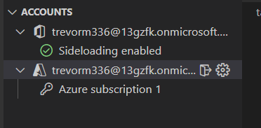
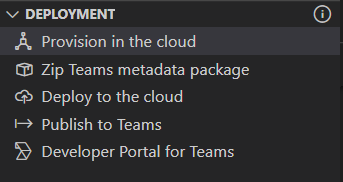
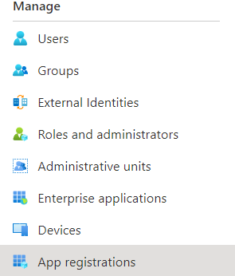
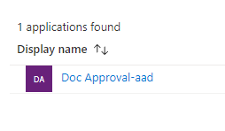
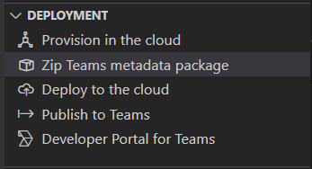

# Care Application Deployment and Configuration

## Overview

Download or clone the repository to get access to the source code for the project. 

## Build Requirements

This guide makes use of the Teams Toolkit Extension for VS Code and can be found here. https://docs.microsoft.com/en-us/microsoftteams/platform/toolkit/teams-toolkit-fundamentals 

## Provisioning the teams application

In Visual Studio Code, make sure that the latest version of the Teams toolkit is installed. Navigate to the extension and login to both the tenant and Azure Accounts.

Next, we need to create an environment for our deployment. This can be done by clicking the + button on the environment section (copy from dev when asked). Enter a new name for the environment when prompted to do so.

Once the environment has been created, click on the provision to cloud item in the deployment tab. This will take some time for the resources to be created. 

After the app has been provisioned in the cloud, a couple of new files will appear in the project. We will update these at a later stage. For the next stage we can just click on the deploy to cloud to setup the resources in Azure. 

Navigate to [https://portal.azure.com](https://portal.azure.com/) and sign into your account. This account needs administrative permissions to allow the app scopes on the registration. 

Once there, navigate to the Azure Active Directory menu item. 

Next navigate to the App Registrations menu item. 

Click on the item that we created. 

Navigate to the Api Permissions menu item 

Click on the scopes with the warning triangle and the click on the grant access button for both 

## Creating the Teams Application Packages

From Visual Studio Code, in the Teams toolkit extension click on the Zip Teams Metadata package.

Navigate to the SourceDir\tabs\build\appPackage folder and there will be a zip file with the name appPackage.YourEnvironment.zip.

Copy this file to a new folder in c:\temp for example. We will need to create two copies of this zip file to be able to deploy bot applications in teams.

Rename the files accordingly

## Registering Teams Applications

Delete the original zip files in the temp directory so that we can recreate them. Next create the new zip files from the directories with the same names. NOTE that there should not be subdirectories in the zip files and the content should be in the root of the zip.

Navigate to [https://admin.teams.com](https://admin.teams.com/) and sign in.

Navigate to the Manage Apps Menu Item

Click on the Upload App button and browse the temp folder where the zip files were created. Both the application files should be uploaded.

